# 复现论文—配置虚拟环境

## 1.查看自己的CUDA版本

win+r 在cmd下输入

nvidia-smi

查看CUDA版本号（要小于等于）

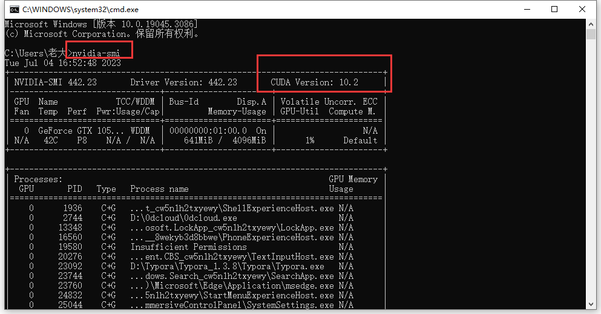

## 2.查看论文README.md中的Requirements

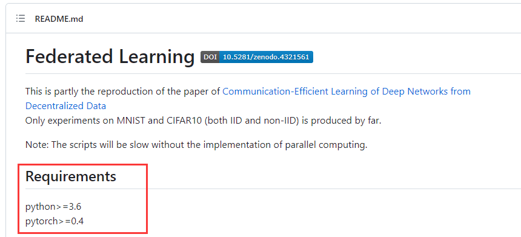

以及requirements.txt

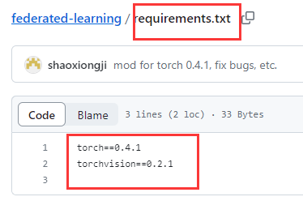

获取torch版本号和torchvision版本号

## 3.去Pytorch官网查看对应版本号的链接

Pytorch官网：

[Previous PyTorch Versions | PyTorch](https://pytorch.org/get-started/previous-versions/)

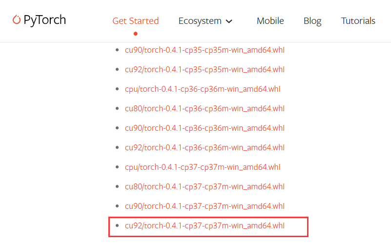

**cu92代表cuda9.2**

**cp37代表python3.7**

## 4.创建虚拟环境

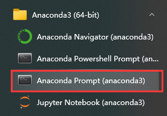

输入命令：conda create -n 环境名字 python=3.xx

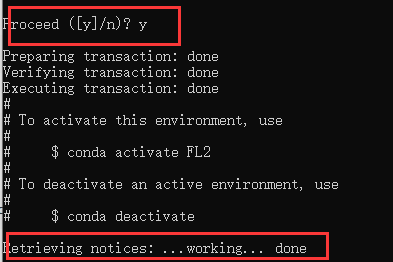

完成创建

## 5.激活环境
输入命令：conda activate 环境名字

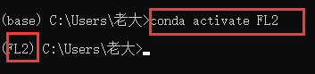

## 6.添加国内镜像

在**虚拟环境**中也就是前缀是（环境名字）依次添加以下指令：

conda config --add channels https://mirrors.ustc.edu.cn/anaconda/pkgs/free/

conda config --add channels https://mirrors.ustc.edu.cn/anaconda/pkgs/main/

conda config --add channels https://mirrors.ustc.edu.cn/anaconda/cloud/pytorch/

*如何查看安装了那些镜像源：*

conda config --show-sources

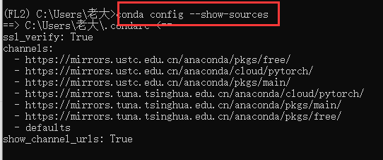

## 7.安装cuda

根据3中所查到的版本号安装cuda

conda install cudatoolkit=xx.x

## 8.安装cudnn

可以指定版本也可以不指定，会根据下载的cuda来自动下载匹配的cudnn

conda install cudnn

## 9.安装torch
pip install 
+
右键所选版本包 -> 复制链接

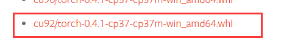

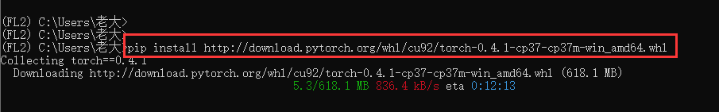

## 10.安装torchvision

pip install torchvision==0.2.1 -i https://pypi.tuna.tsinghua.edu.cn/simple

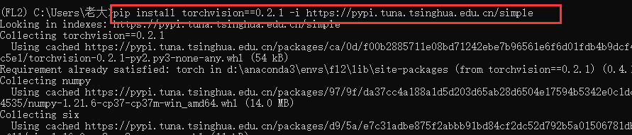

## 11.检查是否安装成功

**！！！！检查是否安装成功！！！！**

先输入python

再输入

import torch 
print(torch.__version__)
print(torch.cuda.is_available())

要显示True 即代表安装成功！！

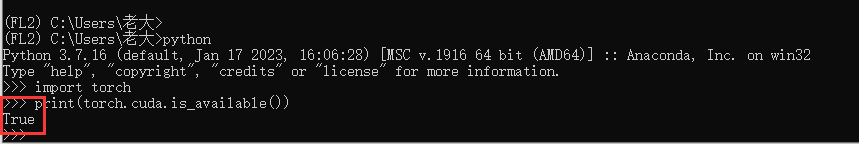

到此为止

虚拟环境配置完成

## 12.安装额外包
回到代码

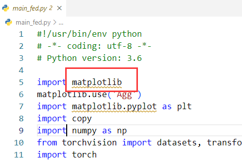

导包错误 说明还有包没下载

conda install matplotlib

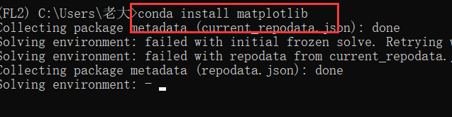

安装好后 代码就没报错了

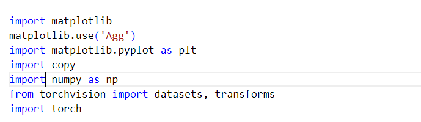

这样可以开始运行了
*（但是还没有结束 嘻嘻）*
*（没办法 安装环境就是如此要有耐心！）*

## 13.运行代码+修改bug

1. 报错1

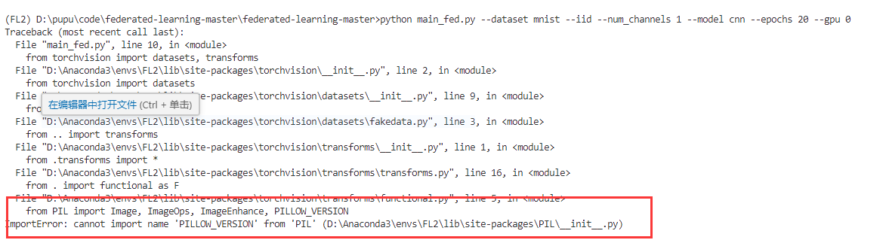

​		说明pillow版本太高

​		可以降低版本

​		conda install pillow==6.2.1

2. 报错2

   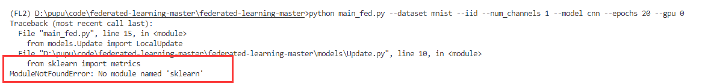

   说明缺少sklearn包

   *注意！！*

   sklearn的包名是scikit-learn

   所以输入指令：

   conda install scikit-learn

   

一直运行+修改bug

直到能运行成功

(恭喜！！！！！！）

(喜大普奔！！！！)

(完结撒花✿✿ヽ(°▽°)ノ✿)

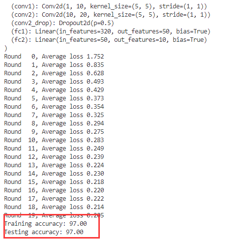

   

