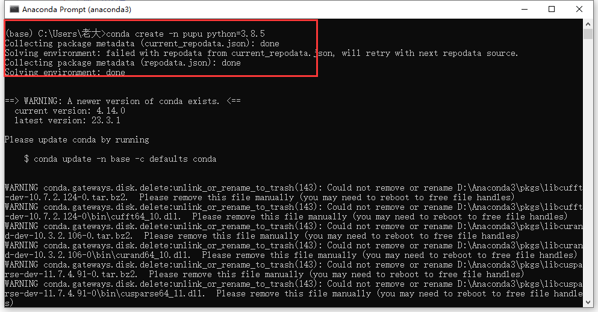
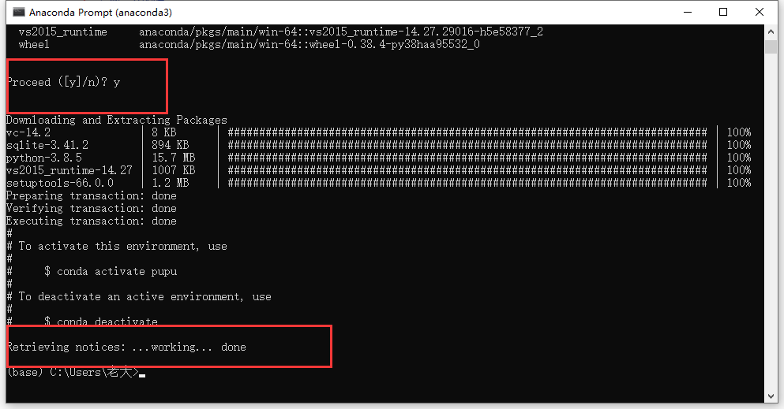
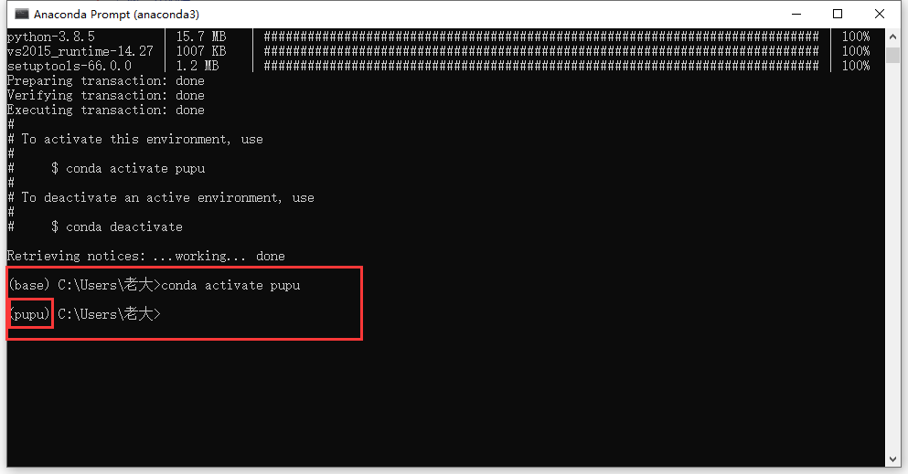
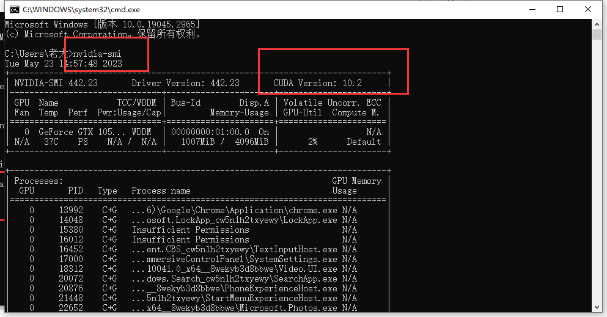
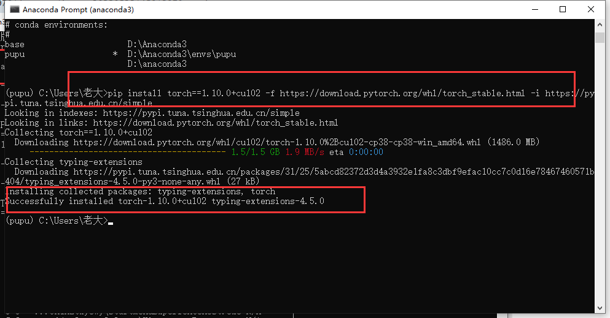
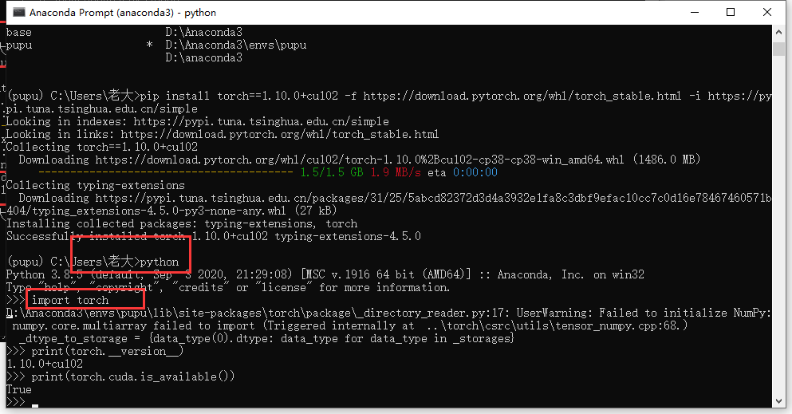
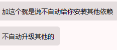

# 配置虚拟环境


1. 配置虚拟环境

   conda create -n 虚拟环境名 python=3.x

   

   

3. 激活虚拟环境

   conda activate 虚拟环境名

   

4. 查看自己的CUDA版本

   win+r 在cmd下输入

   nvidia-smi

   查看CUDA版本号

   

4. 根据CUDA版本下载torch

   pip install torch==1.10.0+cu102 -f https://download.pytorch.org/whl/torch_stable.html -i https://pypi.tuna.tsinghua.edu.cn/simple

   

   ```
   conda install pytorch==1.7.1 torchvision==0.8.2 torchaudio==0.7.2 cudatoolkit=9.2 -c pytorch
   ```

   

5. 查看torch是否安装成功

   先输入python

   再输入

   import torch 
   print(torch.__version__)
   print(torch.cuda.is_available())

   

   

阿里云 http://mirrors.aliyun.com/pypi/simple/
中国科技大学 https://pypi.mirrors.ustc.edu.cn/simple/
豆瓣 http://pypi.douban.com/simple/
清华大学 https://pypi.tuna.tsinghua.edu.cn/simple/
中国科学技术大学 http://pypi.mirrors.ustc.edu.cn/simple/

pip list 查看已安装的包

pip uninstall xxx

[Previous PyTorch Versions | PyTorch](https://pytorch.org/get-started/previous-versions/)

--no-deps 



[(10条消息) 小白记录第一次用Anaconda复现论文配置环境Pyrorch+cuda+cudnn_conda install cudnn=8.4.0_invisibility-25的博客-CSDN博客](https://blog.csdn.net/weixin_55340484/article/details/125594874)

[(10条消息) 如何创建模型对应的环境_陈大愚的博客-CSDN博客](https://blog.csdn.net/qq_45190143/article/details/131531246?app_version=6.0.0&csdn_share_tail={"type"%3A"blog"%2C"rType"%3A"article"%2C"rId"%3A"131531246"%2C"source"%3A"qq_45190143"}&utm_source=app)


```text
# 第一步：首先退出环境
conda deactivate
 
# 第二步：删除环境
conda remove -n  需要删除的环境名 --all
```
